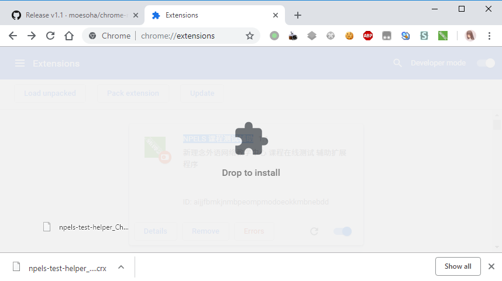
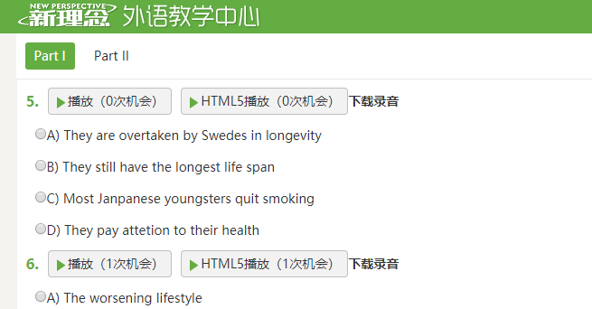
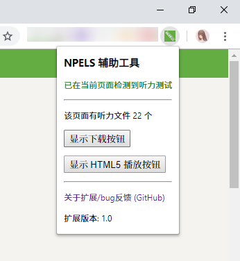

# NPELS 课程测试 Chrome 辅助扩展

## 功能

  - 显示听力录音下载按钮
  - 使用 HTML5 audio 元素实现听力录音播放，因此在原本不能正常完成听力测试的 Chrome 中也可以完成所有测试

## 取得扩展

下面两种方法，任选其一都可以安装本扩展程序。

### Google Chrome 网上商店

*中国大陆用户可能需要小手段才能使用此种方式。*

直接进入[NPELS 课程测试辅助](https://chrome.google.com/webstore/detail/kfcaaiahbmenlegdenhaogcmmmglcjoe)点击安装。

### 离线安装包

*通过此种方式安装的扩展程序不能自动更新。*

从 [GitHub Release](https://github.com/moesoha/chrome-npels-test-helper/releases) 下载最新 .crx 文件。

然后在 Chrome 的地址栏中输入 `chrome://extensions` 进入扩展程序页面。

拖新下载的 .crx 文件进扩展程序页面按提示完成安装。

## 截图

