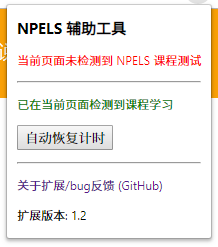
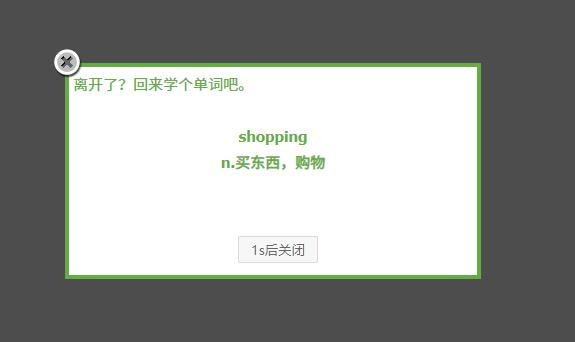

# NPELS 课程测试 Chrome 辅助扩展

## 功能

  - 显示听力录音下载按钮
  - 使用 HTML5 audio 元素实现听力录音播放，因此在原本不能正常完成听力测试的 Chrome 中也可以完成所有测试
  - 课程学习页面每隔一段时间会弹出一个单词，如果不点击关闭单词，课程学习计时会暂停。这个扩展可以**自动关闭**单词框，自动恢复计时

<!-- 还有一个蛇皮功能，在测试页面上点击扩展，扩展页面上疯狂点击“该页面有听力文件 12 个”中的数字，比如“12”，可以查看当前测试答案。 -->

## 安装/更新扩展

下面两种方法，任选其一都可以安装本扩展程序。

### 1. 通过安装包

**国内用户可以访问[这个页面](http://huaji233.coding.me/npels/index.html)，你就不需要阅读下面的内容了。**

从 [GitHub Release](https://github.com/moesoha/chrome-npels-test-helper/releases) 下载最新 .crx 文件。

然后在 Chrome 的地址栏中输入 `chrome://extensions` 进入扩展程序页面。

扩展程序页面右上角打开开发者模式，然后拖新下载的 .crx 文件进扩展程序页面按提示完成安装。

### 2. Google Chrome 网上商店

*中国大陆用户可能需要小手段才能使用此种方式。*

直接进入[NPELS 课程测试辅助](https://chrome.google.com/webstore/detail/kfcaaiahbmenlegdenhaogcmmmglcjoe)点击安装。

## 截图

